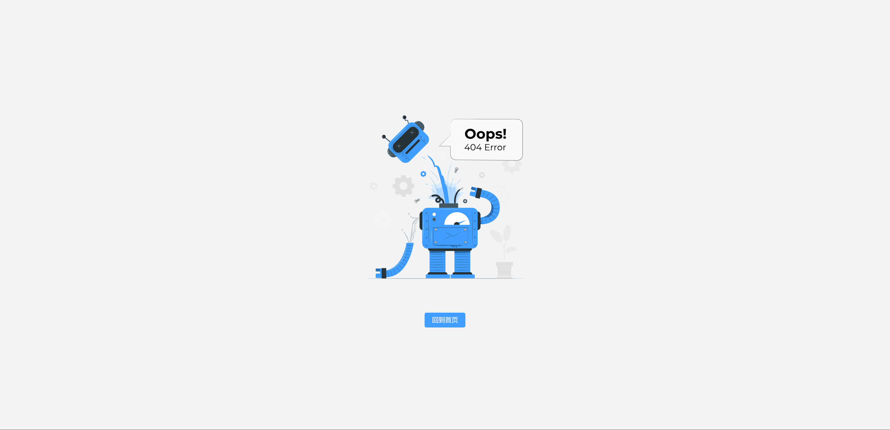
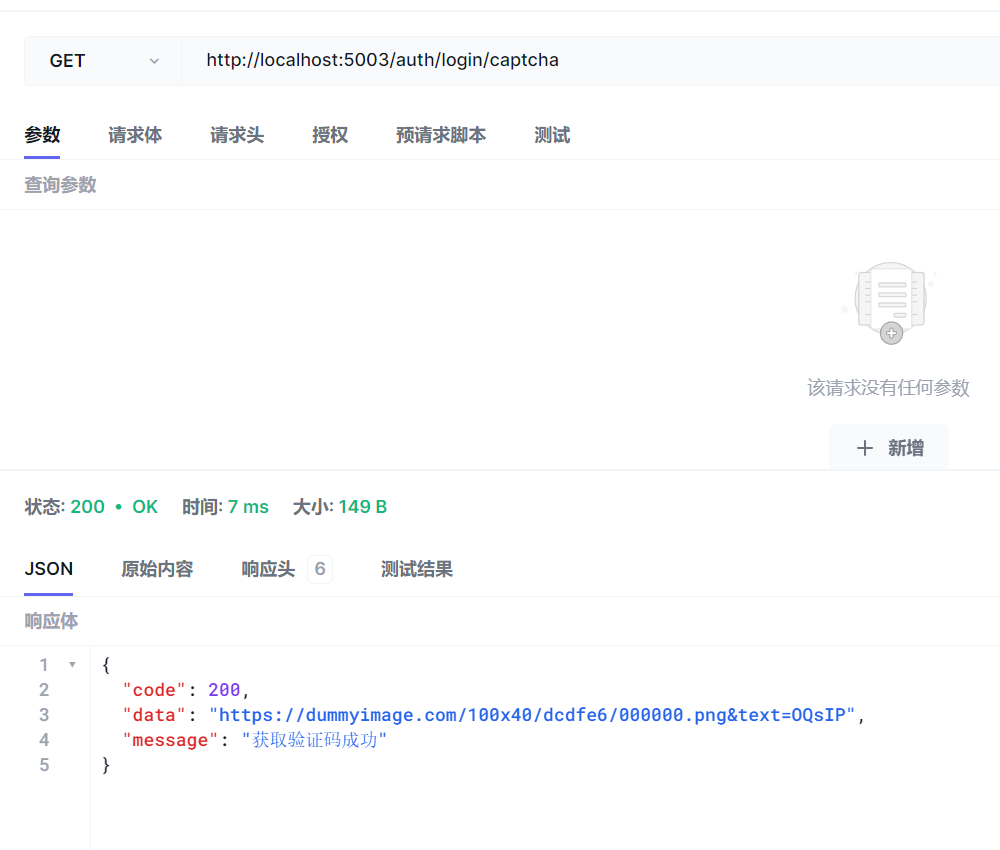

# ✨界面展示

## 登录

## 注册

## 垃圾检测

## 用户管理

## 404 Not Found页面

## 403 拒绝访问页面

## 黑暗模式

## 深蓝模式

## 灰色模式

## 色弱模式

 

# ✨技术特性

## 深度学习

- **YOLOv5🚀**：高效、准确的目标检测算法，实时识别检测图像和视频中的各种对象
- **PyTorch**：机器学习框架，以动态计算图为基础，具有灵活性和易用性
- **OpenCV**：计算机视觉库，提供了丰富的图像和视频处理功能

## 前端

- **Vue3**：采用 Vue3 + script setup 最新的 Vue3 组合式 API
- **Element Plus**：Element UI 的 Vue3 版本
- **Pinia**: 类型安全、可预测的状态管理库
- **Vite**：新型前端构建工具
- **Vue Router**：路由
- **TypeScript**：JavaScript 语言的超集
- **PNPM**：更快速的，节省磁盘空间的包管理工具
- **Scss**：和 Element Plus 保持一致
- **CSS 变量**：主要控制项目的布局和颜色
- **ESlint**：代码校验
- **Prettier**：代码格式化
- **Axios**：发送网络请求
- **UnoCSS**：具有高性能且极具灵活性的即时原子化 CSS 引擎
- **注释**：各个配置项都写有尽可能详细的注释
- **兼容移动端**: 布局兼容移动端页面分辨率

## 后端

- **MySQL 8**：关系型数据库管理系统，全文索引、多源复制、更强大的JSON支持
- **Docker**：轻量级的虚拟化技术，快速构建、部署和运行应用程序
- **Flask**：用Python编写的微型Web框架
- **Werkzeug**：用于Web服务器网关接口（WSGI）应用程序的Python编程语言的实用程序库
- **SQLAlchemy**：ORM映射、SQL表达式构建、数据库连接池
- **Flask-Migrate**：数据库迁移
- **Flask-JWT-Extended**：JWT的认证和授权
- **Flask-WTF**：Web表单生成和验证功能
- **Flask-Mail**：电子邮件发送和验证
- **PyMySQL**：MySQL数据库驱动程序

 

# ✨功能介绍

## 登录

- 前端表单校验
- 后端表单校验
- 密码加密存储
- 图片验证码
- 登陆成功后设置Token
- Token记忆登录状态

## 注册

- 前端表单校验
- 后端表单校验
- 邮箱验证码
- 注册成功后设置Token自动登录

## 模型推断

- 切换调用模型
- 上传图片
- 垃圾检测

## 用户管理

- Token鉴权
- 新增用户
- 修改用户信息
- 修改用户权限
- 启用/禁用用户
- 永久删除用户

## 权限管理

- 内置页面权限（动态路由）
- 指令权限
- 权限函数
- 路由守卫

## 界面多模式切换

- 普通主题
- 黑暗主题
- 深蓝主题
- 灰色模式
- 色弱模式

 

# ✨数据库设计

 

# ✨系统测试

## 功能测试

### 模型推断

### 用户管理

模糊查询

新增用户

修改用户

删除用户

批量删除用户

## 前端测试

### 登录模块

空值校验

字符长度校验

用户有效性校验（被禁用用户无法登录）

### 验证码模块

### 注册模块

空值校验

邮箱格式校验

字符长度校验

确认密码校验

邮箱不能为空不能获取验证码

邮箱已经被注册不能获取验证码

邮箱未被注册获取邮箱验证码成功

### 用户管理模块

用户管理模块下所有功能需要登录（请求携带Token）

并且需要角色为管理员才会在前端可见管理模块

 

管理员用户可见用户管理模块

普通用户不可见用户管理模块

 

其余功能只涉及简单的CRUD操作

不再重复测试

~~懒得测~~

 

## 后端测试

### 登录模块

获取登录验证码

空值校验（仅校验用户名，密码与验证码后端同样进行了空值校验）

密码字符长度校验

用户有效性校验（被禁用用户无法登录）

用户名密码真值校验

登陆成功返回Token

 

### 验证码模块

空值校验

邮箱是否被注册校验

邮箱未被注册成功获取验证码

### 注册模块

空值校验（仅测试校验用户名，密码与验证码后端同样进行了空值校验）

邮箱格式校验

确认密码校验

注册成功返回Token自动登录

### 用户管理模块

用户管理模块下所有功能需要登录（请求携带Token）

并且需要角色为管理员才会在前端可见管理模块

 

请求未携带Token鉴权失败

请求携带Token鉴权成功

 

其余功能只涉及简单的CRUD操作

不再重复测试

~~懒得测~~